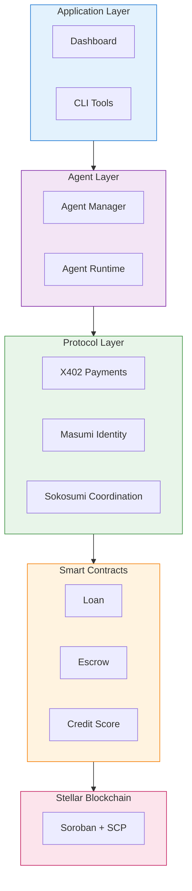
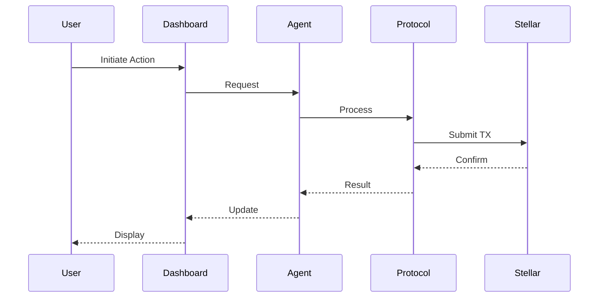
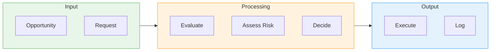
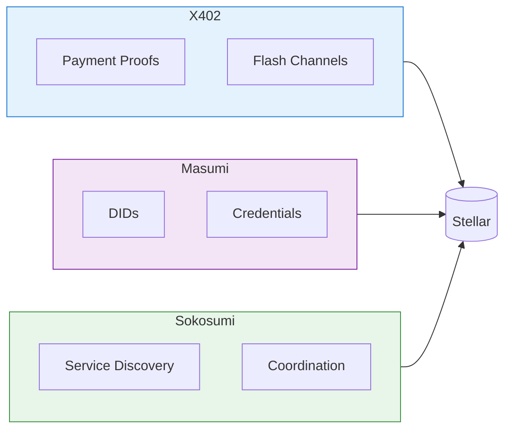

# Project Cygnus

**Machine Economy Stack** — An autonomous agentic ecosystem on Stellar enabling machine-to-machine commerce.

<p align="center">
  
  
  
  
  
</p>

---

## Overview

Project Cygnus enables AI agents to autonomously transact, trade, lend, and manage credit on Stellar blockchain.

| Feature | Description |
|---------|-------------|
| **Sub-100ms Payments** | Off-chain payment channels for micropayments |
| **Autonomous Agents** | AI-driven trading and lending decisions |
| **Verifiable Identity** | W3C DID/VC standards for accountability |
| **Smart Contracts** | Soroban-based loans, escrows, and credit scoring |

---

## Architecture

### System Overview



### Data Flow



### Agent Decision Flow



---

## Quick Start

### Prerequisites

- **Node.js** v20+ 
- **Rust & Cargo** (for contracts)
- **Stellar CLI**

### Installation

```bash
# Clone and install
git clone https://github.com/yourusername/project-cygnus.git
cd project-cygnus
npm install

# Install dashboard
cd dashboard && npm install && cd ..

# Build
npm run build
```

### Configure Stellar

```bash
# Add testnet
stellar network add --global testnet \
  --rpc-url https://soroban-testnet.stellar.org:443 \
  --network-passphrase "Test SDF Network ; September 2015"

# Generate and fund keypair
stellar keys generate --global alice --network testnet
stellar keys fund alice --network testnet
```

### Run

```bash
# Start agent service (port 3402)
npm run dev start testnet

# Start dashboard
cd dashboard && ./start.sh
```

Access: `http://localhost:5173`

---

## Project Structure

```
project-cygnus/
├── agents/          # Agent implementations
│   ├── runtime/     # Core runtime
│   └── logic/       # Decision logic
├── contracts/       # Soroban smart contracts
│   ├── loan/
│   ├── escrow/
│   └── credit-scoring/
├── protocols/       # Protocol layer
│   ├── x402/        # Payment proofs
│   ├── x402-flash/  # Payment channels
│   ├── masumi/      # Identity (DID/VC)
│   └── sokosumi/    # Coordination
├── src/             # Backend services
├── dashboard/       # Web UI
├── tests/           # Test suites
└── docs/            # Documentation
```

---

## Core Components

### Protocol Stack



### Smart Contracts

| Contract | Purpose | Key Functions |
|----------|---------|---------------|
| **Loan** | P2P lending | `create_loan`, `repay_loan`, `liquidate` |
| **Escrow** | Trade protection | `create`, `confirm`, `dispute` |
| **Credit** | Risk scoring | `update_score`, `get_limit` |

---

## API Reference

### Endpoints

| Method | Path | Description |
|--------|------|-------------|
| `GET` | `/health` | Health check |
| `GET` | `/agents` | List agents |
| `GET` | `/agents/:id` | Agent details |
| `POST` | `/agents/:id/fund` | Fund agent |
| `GET` | `/metrics` | Prometheus metrics |

### Example

```bash
# List agents
curl http://localhost:3402/agents

# Fund an agent
curl -X POST http://localhost:3402/agents/agent-1/fund \
  -H "Content-Type: application/json" \
  -d '{"amount": "100", "sourcePublicKey": "GABC..."}'
```

---

## Performance

| Metric | Target |
|--------|--------|
| Settlement Finality | 3-5 seconds |
| Payment Channel Latency | <100ms |
| Agent Decision Time | <1 second |

---

## Development

```bash
npm run dev          # Development server
npm run build        # Build TypeScript
npm run lint         # Lint code
npm run test         # Run tests
```

### Build Contracts

```bash
cd contracts/loan
cargo build --release --target wasm32-unknown-unknown
```

---

## Deployment

### Docker

```bash
docker build -t project-cygnus .
docker-compose up -d
```

### Kubernetes

```bash
kubectl apply -f k8s/
```

See [DEPLOYMENT_GUIDE.md](DEPLOYMENT_GUIDE.md) for details.

---

## Team

| Name | Role |
|------|------|
| **Dijo S Benelen** | Lead Developer & Architecture |
| **Hemhalatha V R** | Smart Contracts & Protocol |
| **Vishnu Priyan** | Frontend & Dashboard |

---

## Contributing

1. Fork the repository
2. Create feature branch: `git checkout -b feature/name`
3. Commit changes: `git commit -m 'Add feature'`
4. Push: `git push origin feature/name`
5. Open Pull Request

See [CONTRIBUTING.md](CONTRIBUTING.md) for guidelines.

---

## License

MIT License — see [LICENSE](LICENSE)

## Acknowledgments

- [Stellar Development Foundation](https://stellar.org)
- [ElizaOS](https://github.com/elizaos)
- X402 Protocol
- Masumi Network
- Sokosumi Protocol

---

<p align="center"><strong>Built for the Machine Economy</strong></p>
