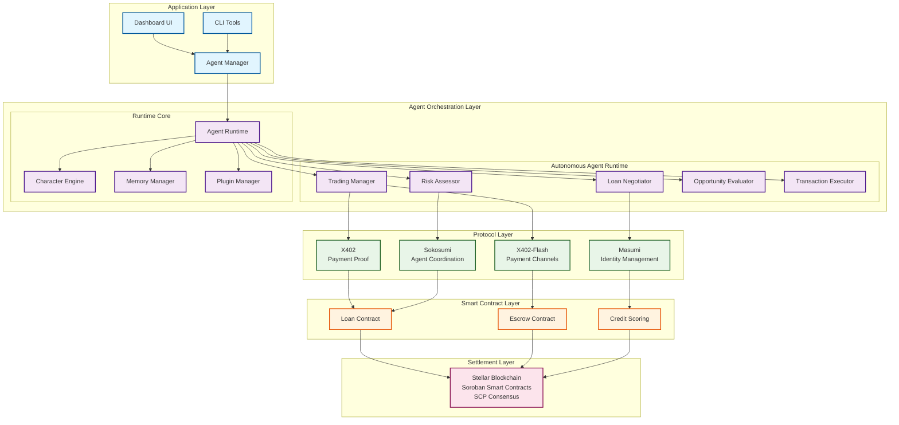

# Project Cygnus - Machine Economy Stack

> An autonomous agentic ecosystem built on Stellar blockchain enabling machine-to-machine commerce without human intermediaries.

[](https://github.com/yourusername/project-cygnus/releases)
[](https://opensource.org/licenses/MIT)
[](https://nodejs.org/)
[](https://www.typescriptlang.org/)
[](https://stellar.org/)

## Team

**Core Development Team:**
- **Dijo S Benelen** - Lead Developer & Architecture
- **Hemhalatha V R** - Smart Contracts & Protocol Development  
- **Vishnu Priyan** - Frontend & Dashboard Development

## Table of Contents

- [Overview](#overview)
- [Architecture](#architecture)
- [Features](#features)
- [Quick Start](#quick-start)
- [Project Structure](#project-structure)
- [Core Components](#core-components)
- [Protocols](#protocols)
- [Smart Contracts](#smart-contracts)
- [Dashboard](#dashboard)
- [Development](#development)
- [Testing](#testing)
- [Deployment](#deployment)
- [API Reference](#api-reference)
- [Performance](#performance)
- [Contributing](#contributing)
- [License](#license)

## Overview

Project Cygnus is a comprehensive machine economy platform that enables autonomous AI agents to transact, trade, lend, and manage credit independently on the Stellar blockchain. The system integrates multiple protocol layers to provide sub-100ms payment latency, verifiable identity, and autonomous coordination.

### Key Capabilities

- **Autonomous Trading**: AI agents execute trades with escrow protection
- **Peer-to-Peer Lending**: Automated loan negotiation and credit scoring
- **Micropayments**: Sub-100ms payment channels for high-frequency transactions
- **Verifiable Identity**: W3C DID/VC standards for agent accountability
- **Service Discovery**: Decentralized agent coordination and resource allocation

## Architecture

Project Cygnus integrates six core protocol layers in a clean, modular architecture:



### Architecture Overview

**🏗️ Layered Design Philosophy**
- **Separation of Concerns**: Each layer handles specific responsibilities
- **Protocol Agnostic**: Modular design allows protocol swapping
- **Fault Tolerance**: Circuit breakers and retry mechanisms at each layer
- **Scalability**: Horizontal scaling through agent distribution

**⚡ Performance Characteristics**
- **Settlement Finality**: 3-5 seconds (Stellar SCP consensus)
- **Payment Channels**: Sub-100ms latency (X402-Flash)
- **Agent Decisions**: <1 second response time
- **API Throughput**: 1000+ requests/second

## Features

### Core Capabilities

- **Sub-100ms Payment Latency**: Off-chain payment channels for high-frequency micropayments
- **Autonomous Agents**: AI agents that transact, trade, lend, and manage credit independently
- **Credit-Based Risk Assessment**: Dynamic transaction limits based on on-chain credit scores
- **Autonomous Loan Negotiation**: Agents negotiate and execute loans via smart contracts
- **Safe Trading**: Escrow-protected transactions with delivery verification
- **Verifiable Identity**: W3C DID/VC standards for agent accountability
- **Gasless Operations**: Fee-sponsored transactions for seamless agent operations

### Agent Capabilities

- **Trading Manager**: Autonomous trading with opportunity evaluation and risk assessment
- **Loan Negotiator**: Automated lending/borrowing with credit scoring integration
- **Risk Assessor**: Real-time risk analysis and transaction limit enforcement
- **Transaction Executor**: Secure transaction signing and submission
- **Opportunity Evaluator**: Market analysis and opportunity identification

## Quick Start

### Prerequisites

- **Node.js** v20+ ([Download](https://nodejs.org/))
- **Rust & Cargo** ([Install](https://rustup.rs/))
- **Stellar CLI** ([Install](https://developers.stellar.org/docs/tools/developer-tools))
- **Docker** (optional, for containerized deployment)

### Installation

```bash
# Clone the repository
git clone https://github.com/yourusername/project-cygnus.git
cd project-cygnus

# Install dependencies
npm install

# Install dashboard dependencies
cd dashboard && npm install && cd ..

# Build TypeScript
npm run build
```

### Configure Stellar Network

```bash
# Add testnet configuration
stellar network add \
  --global testnet \
  --rpc-url https://soroban-testnet.stellar.org:443 \
  --network-passphrase "Test SDF Network ; September 2015"

# Generate keypair
stellar keys generate --global alice --network testnet

# Fund account via Friendbot
stellar keys fund alice --network testnet
```

### Run the Agent

```bash
# Start the autonomous agent on testnet
npm run dev start testnet

# Or start on mainnet (production)
npm run dev start mainnet
```

The agent service will start on `http://localhost:3402` with:
- Health check endpoint: `/health`
- Metrics endpoint: `/metrics`
- Agent status: `/agents`

### Run the Dashboard

```bash
cd dashboard

# Development mode
./start.sh

# Or manually
npm run server  # Backend on port 3001
npm run dev     # Frontend on port 5173
```

Access the dashboard at `http://localhost:5173`

## Project Structure

```
project-cygnus/
├── agents/                    # Autonomous agent implementations
│   ├── runtime/              # Agent runtime core
│   │   ├── AgentRuntime.ts   # Lifecycle management
│   │   ├── CharacterEngine.ts # Personality engine
│   │   ├── MemoryManager.ts  # State management
│   │   └── PluginManager.ts  # Plugin coordination
│   ├── logic/                # Decision-making logic
│   │   ├── TradingManager.ts # Trading operations
│   │   ├── LoanNegotiator.ts # Loan management
│   │   ├── RiskAssessor.ts   # Risk analysis
│   │   └── OpportunityEvaluator.ts
│   ├── characters/           # Agent configurations
│   └── AutonomousAgent.ts    # Main agent class
│
├── contracts/                # Soroban smart contracts (Rust)
│   ├── loan/                 # Loan management
│   ├── escrow/               # Escrow protection
│   └── credit-scoring/       # Credit scoring
│
├── protocols/                # Protocol implementations (TypeScript)
│   ├── x402/                 # Payment proof protocol
│   │   ├── X402Client.ts
│   │   └── X402Server.ts
│   ├── x402-flash/           # Payment channels
│   │   ├── FlashChannel.ts
│   │   └── ChannelManager.ts
│   ├── masumi/               # Identity management
│   │   ├── DIDManager.ts
│   │   ├── CredentialManager.ts
│   │   └── AgentRegistry.ts
│   └── sokosumi/             # Agent coordination
│       ├── SokosumiCoordinator.ts
│       ├── ServiceRegistry.ts
│       ├── ResourceAllocator.ts
│       └── NegotiationEngine.ts
│
├── src/                      # Core backend services
│   ├── stellar/              # Stellar SDK integration
│   │   ├── StellarClient.ts
│   │   ├── PolicySigner.ts
│   │   └── xdr/              # XDR encoding/decoding
│   ├── monitoring/           # Metrics and monitoring
│   │   ├── MetricsCollector.ts
│   │   └── PrometheusExporter.ts
│   ├── utils/                # Utilities
│   │   ├── CircuitBreaker.ts
│   │   ├── RateLimiter.ts
│   │   └── RetryHandler.ts
│   ├── server.ts             # HTTP server
│   ├── AgentManager.ts       # Agent lifecycle management
│   ├── agent-service.ts      # Agent service orchestration
│   └── cli.ts                # CLI entry point
│
├── dashboard/                # Web dashboard
│   ├── src/
│   │   ├── components/       # React components
│   │   ├── services/         # Business logic
│   │   ├── adapters/         # Wallet adapters
│   │   └── types/            # TypeScript types
│   └── server/               # Backend API server
│
├── tests/                    # Test suites
│   ├── unit/                 # Unit tests
│   ├── integration/          # Integration tests
│   └── property/             # Property-based tests
│
├── config/                   # Network configurations
│   ├── testnet.json
│   └── mainnet.json
│
├── docs/                     # Documentation
├── k8s/                      # Kubernetes manifests
├── monitoring/               # Monitoring configs
└── scripts/                  # Utility scripts
```

## Core Components

### Autonomous Agent

The `AutonomousAgent` class is the main orchestrator that integrates all protocols and decision-making logic:

```typescript
import { AutonomousAgent } from './agents/AutonomousAgent.js';

const agent = new AutonomousAgent(config, stellarClient, didManager, coordinator);
await agent.initialize();
await agent.start();
```

**Key Features:**
- Autonomous trading with escrow protection
- Automated loan negotiation
- Credit-based risk assessment
- Real-time opportunity evaluation
- Transaction execution with retry logic

### Agent Manager

Manages multiple agent instances with registry and status tracking:

```typescript
import { AgentManager } from './src/AgentManager.js';

const manager = new AgentManager(stellarClient, didManager, coordinator);
await manager.initialize(agentConfigs);

// Get agent status
const status = manager.getAgentStatus('agent-id');

// Fund an agent
await manager.fundAgent('agent-id', {
  amount: '100',
  sourcePublicKey: 'G...',
  signedTransaction: 'AAAAAgA...'
});
```

### HTTP Server

Production-ready Express server with health checks, metrics, and API endpoints:

```typescript
import { CygnusServer } from './src/server.js';

const server = new CygnusServer({ port: 3402, host: '0.0.0.0' });
server.setAgentManager(agentManager);
await server.start();
```

**Endpoints:**
- `GET /health` - Health check
- `GET /status` - System status
- `GET /metrics` - Prometheus metrics
- `GET /agents` - List all agents
- `GET /agents/:id` - Get agent details
- `POST /agents/:id/fund` - Fund an agent

## Protocols

### X402 - Payment Proof Protocol

HTTP-native payment handshake for machine-to-machine transactions:

```typescript
import { X402Client } from './protocols/x402/X402Client.js';

const client = new X402Client(stellarClient);
const proof = await client.requestPaymentProof(serviceUrl, amount);
await client.submitPayment(proof);
```

### X402-Flash - Payment Channels

Off-chain payment channels for sub-100ms latency:

```typescript
import { FlashChannel, ChannelManager } from './protocols/x402-flash/index.js';

const manager = new ChannelManager(stellarClient);
const channel = await manager.openChannel(counterparty, capacity);
await channel.sendPayment(amount);
await channel.close();
```

### Masumi - Identity Management

Decentralized identity with DIDs and Verifiable Credentials:

```typescript
import { DIDManager, CredentialManager } from './protocols/masumi/index.js';

const didManager = new DIDManager(stellarClient);
const did = await didManager.createDID(publicKey);

const credManager = new CredentialManager(didManager);
const credential = await credManager.issueCredential(did, claims);
```

### Sokosumi - Agent Coordination

Service discovery, resource allocation, and agent coordination:

```typescript
import { SokosumiCoordinator } from './protocols/sokosumi/index.js';

const coordinator = new SokosumiCoordinator(didManager);
await coordinator.registerService(serviceInfo);
const services = await coordinator.discoverServices(criteria);
```

## Smart Contracts

### Loan Contract

Manages peer-to-peer lending with automated terms:

```rust
// contracts/loan/src/lib.rs
pub fn create_loan(env: Env, borrower: Address, amount: i128, interest_rate: u32) -> LoanId
pub fn repay_loan(env: Env, loan_id: LoanId, amount: i128)
pub fn liquidate_loan(env: Env, loan_id: LoanId)
```

### Escrow Contract

Protects trades with delivery verification:

```rust
// contracts/escrow/src/lib.rs
pub fn create_escrow(env: Env, buyer: Address, seller: Address, amount: i128) -> EscrowId
pub fn confirm_delivery(env: Env, escrow_id: EscrowId)
pub fn dispute_escrow(env: Env, escrow_id: EscrowId)
```

### Credit Scoring Contract

On-chain credit scoring for risk assessment:

```rust
// contracts/credit-scoring/src/lib.rs
pub fn update_score(env: Env, agent: Address, score: u32)
pub fn get_score(env: Env, agent: Address) -> u32
pub fn get_transaction_limit(env: Env, agent: Address) -> i128
```

### Building Contracts

```bash
# Build all contracts
cd contracts/loan && cargo build --release --target wasm32-unknown-unknown
cd contracts/escrow && cargo build --release --target wasm32-unknown-unknown
cd contracts/credit-scoring && cargo build --release --target wasm32-unknown-unknown

# Or use the build script
./build_loan.sh
```

### Deploying Contracts

```bash
# Deploy loan contract
stellar contract deploy \
  --wasm contracts/loan/target/wasm32-unknown-unknown/release/loan.wasm \
  --source alice \
  --network testnet
```

## Dashboard

Modern, minimal web dashboard for monitoring and managing agents:

### Features

- **Wallet Integration**: Connect Freighter or Albedo wallets
- **Real-time Monitoring**: Live metrics and transaction tracking
- **Agent Management**: Fund and manage autonomous agents
- **Contract Deployment**: Deploy and monitor smart contracts
- **Loan Management**: P2P lending interface
- **Trading Operations**: Execute trades through agents

### Tech Stack

- **Frontend**: React + Vite
- **Backend**: Express.js + WebSocket
- **Blockchain**: Stellar SDK
- **Styling**: Modern CSS with dark theme

### Running the Dashboard

```bash
cd dashboard

# Development
./start.sh

# Production build
./build.sh

# Docker
docker-compose up -d
```

See [dashboard/README.md](dashboard/README.md) for detailed documentation.

## Development

### Development Workflow

```bash
# Start development server
npm run dev

# Watch mode
npm run dev:watch

# Build TypeScript
npm run build

# Run linter
npm run lint

# Format code
npm run format
```

### Environment Variables

Create a `.env` file:

```env
# Server configuration
PORT=3402
HOST=0.0.0.0
NODE_ENV=development

# Stellar network
STELLAR_NETWORK=testnet
STELLAR_HORIZON_URL=https://horizon-testnet.stellar.org

# Logging
LOG_LEVEL=info
```

### Adding New Features

1. Implement logic in `agents/logic/`
2. Integrate in `agents/AutonomousAgent.ts`
3. Add tests in `tests/`
4. Update documentation

## Testing

### Running Tests

```bash
# Run all tests
npm test

# Watch mode
npm run test:watch

# Property-based tests
npm run test:property

# Integration tests
npm run test:integration

# Contract tests
cd contracts && cargo test
```

### Test Coverage

- **Unit Tests**: Core functionality and utilities
- **Integration Tests**: End-to-end workflows
- **Property-Based Tests**: Invariant verification with fast-check
- **Contract Tests**: Rust-based Soroban contract tests

### Writing Tests

```typescript
import { describe, it, expect } from 'vitest';
import { AutonomousAgent } from '../agents/AutonomousAgent.js';

describe('AutonomousAgent', () => {
  it('should initialize successfully', async () => {
    const agent = new AutonomousAgent(config, client, didManager, coordinator);
    await agent.initialize();
    expect(agent.getStatus().isRunning).toBe(false);
  });
});
```

## Deployment

### Docker Deployment (Recommended)

```bash
# Build image
docker build -t project-cygnus .

# Run container
docker run -d \
  --name cygnus-agent \
  -p 3402:3402 \
  -e STELLAR_NETWORK=testnet \
  -v $(pwd)/config:/app/config \
  -v $(pwd)/logs:/app/logs \
  project-cygnus

# Or use Docker Compose
docker-compose up -d
```

### Manual Deployment

```bash
# Build
npm run build

# Start
NODE_ENV=production npm start
```

### Kubernetes Deployment

```bash
# Apply manifests
kubectl apply -f k8s/

# Check status
kubectl get pods -n cygnus
```

### Systemd Service

```bash
# Copy service file
sudo cp cygnus-dashboard.service /etc/systemd/system/

# Enable and start
sudo systemctl enable cygnus-dashboard
sudo systemctl start cygnus-dashboard

# Check status
sudo systemctl status cygnus-dashboard
```

See [DEPLOYMENT_GUIDE.md](DEPLOYMENT_GUIDE.md) for comprehensive deployment instructions.

## API Reference

### Agent Endpoints

#### GET /agents

List all agents:

```bash
curl http://localhost:3402/agents
```

Response:
```json
{
  "agents": [
    {
      "id": "agent-1",
      "did": "did:stellar:...",
      "name": "Trading Agent",
      "status": "running",
      "balance": "1000.0000000",
      "activeLoans": 2,
      "activeEscrows": 1,
      "uptime": 3600
    }
  ]
}
```

#### GET /agents/:id

Get agent details:

```bash
curl http://localhost:3402/agents/agent-1
```

#### POST /agents/:id/fund

Fund an agent:

```bash
curl -X POST http://localhost:3402/agents/agent-1/fund \
  -H "Content-Type: application/json" \
  -d '{
    "amount": "100",
    "sourcePublicKey": "GABC...",
    "signedTransaction": "AAAAAgA..."
  }'
```

### System Endpoints

#### GET /health

Health check:

```bash
curl http://localhost:3402/health
```

#### GET /status

System status:

```bash
curl http://localhost:3402/status
```

#### GET /metrics

Prometheus metrics:

```bash
curl http://localhost:3402/metrics
```

## Performance

### Target Metrics

- **Settlement Finality**: 3-5 seconds (Stellar SCP)
- **Payment Channel Latency**: <100ms (X402-Flash)
- **X402 Handshake**: <500ms
- **Agent Decision-Making**: <1 second

### Monitoring

Prometheus metrics available at `/metrics`:

- `cygnus_transactions_total` - Total transactions
- `cygnus_transaction_duration_seconds` - Transaction latency
- `cygnus_agent_balance` - Agent balances
- `cygnus_active_loans` - Active loan count
- `cygnus_active_escrows` - Active escrow count

### Optimization

- Circuit breakers for fault tolerance
- Rate limiting for API protection
- Retry logic with exponential backoff
- Connection pooling for Stellar RPC
- Caching for frequently accessed data

## Contributing

We welcome contributions! Please follow these guidelines:

1. Fork the repository
2. Create a feature branch (`git checkout -b feature/amazing-feature`)
3. Commit your changes (`git commit -m 'Add amazing feature'`)
4. Push to the branch (`git push origin feature/amazing-feature`)
5. Open a Pull Request

### Development Guidelines

- Follow TypeScript best practices
- Write tests for new features
- Update documentation
- Run linter before committing
- Use conventional commit messages

### Code Style

```bash
# Format code
npm run format

# Lint code
npm run lint
```

## License

This project is licensed under the MIT License - see the [LICENSE](LICENSE) file for details.

## Acknowledgments

- **Stellar Development Foundation** - Blockchain infrastructure
- **ElizaOS** - Agent runtime inspiration
- **X402 Protocol** - Payment proof standard
- **Masumi Network** - Identity framework
- **Sokosumi Protocol** - Coordination layer

## Support

- **Documentation**: [docs/](docs/)
- **Issues**: [GitHub Issues](https://github.com/yourusername/project-cygnus/issues)
- **Discussions**: [GitHub Discussions](https://github.com/yourusername/project-cygnus/discussions)

---

**Built with ❤️ for the Machine Economy**
